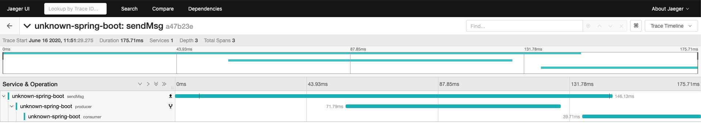
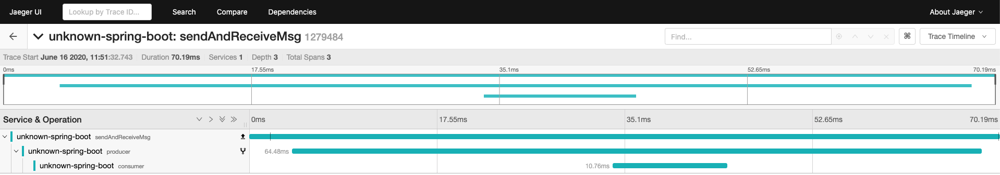

# Opentracing Spring RabbitMQ Example

This project is an example of tracing RabbitMQ messages between producer and consumer.

## Pre-requisite

### Deploy Istio with Jaeger tracer

We are not going to cover installing Istio with Jaeger

Please check below before this project

> Jaeger-agent, Jaeger-collector
>
> Setting label 'istio-injection' to your namespace

### Deploy RabbitMQ

```bash
$ kubectl apply -f kube-resources/rabbitmq.yaml -n (name-space)
```
- Message Queue Port: 5672
- RabbitMQ UI Web Port: 15672

### Set Docker Registry URL

1. Set an environment variable
```bash
$ export REGISTRY_ADDR=(docker-registry-url)
```
or

2. Replace variables with registry url
```bash
$ sed -i 's/\${REGISTRY_ADDR}/(docker-registry-url)/g' build-script.sh
```

### Make build-script Executable

```bash
$ chmod +x build-script.sh
```

## Build

```bash
$ ./build-script (output-image-ver)
```

## Deploy

**Example**
```bash
$ kubectl apply -f kube-resources/consumer.yaml
$ kubectl apply -f kube-resources/producer.yaml
```
Above yaml files are examples. You should modify some information for your environment.

## Usage

```bash
# 1. send msg and no reply
$ curl -XGET (producer-service):8081
> {"text":"Hello Message!","priority":1,"secret":true}

# 2. send msg and wait for reply
$ curl -XGET (producer-service):8081/reply
> {"text":"Reply This Message!","priority":1,"secret":true}
```

## Result

1. send msg and no reply




2. send msg and wait for reply




## Contributing
Pull requests are welcome. For major changes, please open an issue first to discuss what you would like to change.

Please make sure to update tests as appropriate.
